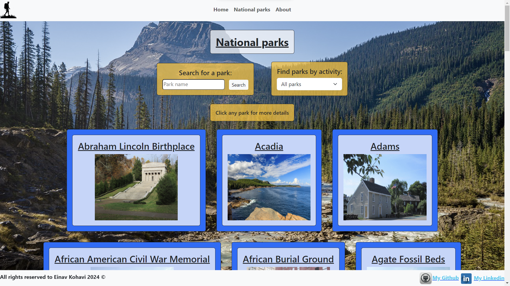

# Park Passage project

Project created by Einav Kohavi

Welcome to Park Passage!
In here I will describe the purpose and funcionalities of the project.

My project is using ReactJS, Bootstrap, and Routing, Linking etc from `react-router-dom`. 
The project's topic is national parks in the US. 
I am using a national parks API from US National Park Service governmental website: 
`https://www.nps.gov/subjects/developer/api-documentation.htm#/parks/getPark` 
This API provides a list of national parks, monuments, historical museums and trails to travel through from all around the US.

---

## Navbar and footer:

The first thing I'd like to address is the navbar and footer. 
I made sure to show a navbar at the top and a footer at the bottom of the website while navigating through different pages (components).

### Navbar (Header)

The navbar allows the user to navigate through the different pages inside the website. 
It includes: 
Home navigation through the home button and the logo as links 
National parks page 
About page

#### Functionality:

The navbar contains a navbar with an unordered list of list items (logo, and text buttons) with `Link` tags wrapping each one, directing to the required url path inside the website.

#### Image:

## 

### Footer

The footer is always shown at the bottom and includes: 
`All rights reserved` text 
Links to my different social platforms 

#### Functionality:

The footer contains a plain text paragraph for `All rights reserved`, and two image + text, each wrapped with `Link` tags directing to my Github and Linkedin pages.

#### Image:

---

## Pages:

### Home page

In the home page, I introduce the users to the website's name, my name and a button for quick navigation to the parks page.

#### Functionality:

Button wrapped in `Link` tag directing to parks page url path.

#### Image:

---

### About page

The about page provides users with information about the website and a message from the website's manager.

#### Functionality:

Only contains a title div and an information div.

#### Image:

---

### National parks page

This page presents objects fetched from the national parks API. 
Each object is shown inside a container with the name and an image of the park. 
The page also allows the user to search for a park by name with an input and a button. 
The user can input the whole name, part of it, or even one letter.

#### Functionality:

##### Fetching:

The parks page component fetches API data and saves it into 2 different arrays (`parksArray and allParks`). 
Also uses a `loading const` to fill the empty page when the API data has not yet been fetched. 
All said consts are using `useState`. 
The fetch occurs inside a `useEffect` function, `fetchApiData` async function with `try and catch` to handle errors. This function returns the data fetched from the API. 
Below the `useEffect`, a function to use it is introduced called `getApiData`. An async function that collects the API data by calling `fetchApiData` and puts them into the 2 arrays using `useState`. 
`parksArray` is later used to show requested parks, while `allParks` is later used to search through all the parks. 
Finally, the `getApiData` function is called at the end of the `useEffect`.  

##### Search park by name:

A `searchParkByName` function is introduced. This function collects the input value from the search input field. 
If the input field is empty, it changes `parksArray` to contain all parks to show them. 
Now, because the used API does not offer a search by name options, and only a search by park code, the function has to go over `allParks` array to find which park includes the input value given. 
The function then collects the appropriate park park code (if no appropriate park is found, `parksArray` is set to be empty). 
The function then uses the found park code and places it inside the url parameter to search by park code, and fetches from it. 
Finally, sets `parksArray` to the fetched data. 
This function is called when the `Search` button is clicked.  

##### Return:

Finally, the return of the `Parks` page is introduced, providing the title, search div, and `map` function to show all required parks 
If `parksArray` is empty, a div saying `No parks found` is returned. 
Otherwise, the `map` function is used to go over `parksArray` and show all parks currently inside it. 
Each park is displayed as a seperate div, and all elements inside it are wrapped with a `Link` that redirects to the `ParkDetails` component of the current park by using it's park code inside the url path.

#### Image:

---

### Park details page

When a user clicks on one of the objects presented in the parks page, he is redirected to the selected park details page. 
In this page, the selected park's detailed information is presented. 
The title for the page will be the park's full name (different from the short name shown in parks page). 
A contained with all the detailed information includes: 
Park description 
Address 
Park activities 
Operating hours 
Contact information 
Park images 
Park website link 
Below this container there is a button to return to the parks page. 

#### Functionality:

##### Fetching:

The `parkDetails` page component fetches API data and saves it into an array of one object containing the required park (`park` const). 
A const for park code is collected from the parameters in the url path using `useParams` (`parkCode` const). 
The `parkCode` const is then placed inside the url to fetch from.
Also uses a `loading const` to fill the empty page when the API data has not yet been fetched. 
All said consts are using `useState`. 
The fetch occurs inside a `useEffect` function, `fetchApiData` async function with `try and catch` to handle errors. This function returns the data fetched from the API. 
If the fetch was unsuccessful, the `park` array will be set to empty.

##### Return:

Finally, the return of the `parkDetails` page is introduced, providing the detailed information of the park. 
If `park` is empty, a div saying `Park not found!` is returned. 
Otherwise, returns a div containing the park full name as title, another div containing all detailed park information, and a button to return to the parks page. 
The website link inside the detailed information div is wrapped with a `Link` tag directing to the park website. 
The button to return to the parks page is wrapped with a `Link` tag directing back to the parks page url path.

#### Images:

##### Top

## 

##### Middle

## 

##### Bottom

---

### Error 404 Page

When the url a user is trying to redirect to is not found inside the routing system of the website, he is redirected to this error page 
The error 404 page includes: 
Message saying the routing has failed 
Warning image 
Button to return to home page

#### Functionality:

A button that is wrapped with a `Link` tag redirects back to home back url path.

#### Image:

---

# Thank you for viewing my project and giving feedback! c: